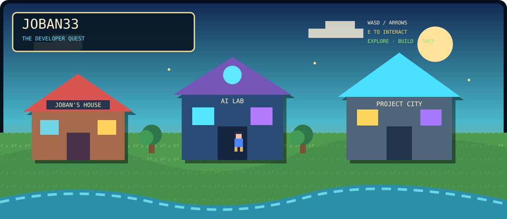

<div align="center">



# 🎮 JOBAN33 // THE DEVELOPER QUEST

### **My GitHub profile is a playable 16-bit RPG.**

**Explore → Interact → Collect XP → Discover projects → Reach GitHub Castle**

<br>

<a href="https://joban33.github.io/Joban33/"></a>
<a href="https://github.com/Joban33"></a>

</div>

---

## 🌍 ENTER JOBAN'S WORLD

This is not a normal developer README.

I wanted my profile to feel like an old-school RPG where **the portfolio itself is the world**. You control a pixel character, explore different areas, talk to NPCs, collect XP, discover projects and eventually reach GitHub Castle.

### 🎮 Controls

| Action | Control |
|---|---|
| Move | `W A S D` / Arrow Keys |
| Interact | `E` / `ENTER` |
| Close / Pause | `ESC` |
| Mobile | On-screen controls |

**[▶ LAUNCH JOBAN'S WORLD](https://joban33.github.io/Joban33/)**

---

## 🗺️ MAP

```text
┌───────────────────────────────────────────────────────────────┐
│                                                               │
│   🏠 JOBAN'S HOUSE        🌲 CODE FOREST      🏙️ PROJECT CITY │
│          │                     │                    │          │
│          └──────────────┬──────┴──────────────┬─────┘          │
│                         │                     │                │
│                     🧠 AI LAB            💻 PROJECTS           │
│                         │                     │                │
│                         └──────────┬──────────┘                │
│                                    │                           │
│                          ⛰️ SKILL MOUNTAIN                     │
│                                    │                           │
│                           🏰 GITHUB CASTLE                     │
│                                                               │
└───────────────────────────────────────────────────────────────┘
```

### 🏠 Player Home

Meet the player behind the character:

**Jobanpreet Singh Gill**  
B.Tech CSE | AI & ML  
Builder / Developer / Explorer

### 🌲 Code Forest

Explore programming-themed locations:

`Python Shrine` · `C++ Forge` · `JavaScript Camp` · `React Portal` · `GitHub Chest`

### 🧠 AI Lab

A futuristic zone dedicated to:

`AI / ML` · `Intelligent Systems` · `Experiments`

The animated **Neural Core** is the center of the lab.

### 🏙️ Project City

The main project zone contains actual projects rather than fake portfolio cards.

**[IMAGE CONVERTER LAB →](https://github.com/Joban33/Image-Converter)**  
**[BLACKSIGNAL STUDIO →](https://github.com/Joban33/hacckker)**

### ⛰️ Skill Mountain

Checkpoints represent the technologies I am actively learning and using:

`Python` · `C++` · `JavaScript` · `React` · `Next.js` · `TypeScript` · `SQL` · `Git/GitHub` · `AI/ML`

### 🏰 GitHub Castle

The final destination.

Repositories · Projects · GitHub · Contact · Profile

---

## ⚔️ CURRENT QUEST

```text
QUEST 01  →  FIND THE CODE FOREST
QUEST 02  →  EXPLORE PROJECT CITY
QUEST 03  →  CLIMB SKILL MOUNTAIN
QUEST 04  →  REACH GITHUB CASTLE

REWARD: EXPERIENCE
```

The game also contains collectible XP shards and save data through `localStorage`.

---

## 👾 PLAYER STATUS

```text
NAME       : JOBAN33
CLASS      : BUILDER
SPECIALTY  : AI / SOFTWARE / WEB
MODE       : BUILD
STATUS     : ONLINE
MISSION    : BUILD SOMETHING WORTH REMEMBERING
```

Current loop:

`LEARN → EXPERIMENT → BUILD → BREAK → REBUILD → SHIP`

---

<div align="center">

### **The portfolio isn't the page. The portfolio is the game.**

**[🎮 PLAY AGAIN](https://joban33.github.io/Joban33/)**

</div>
