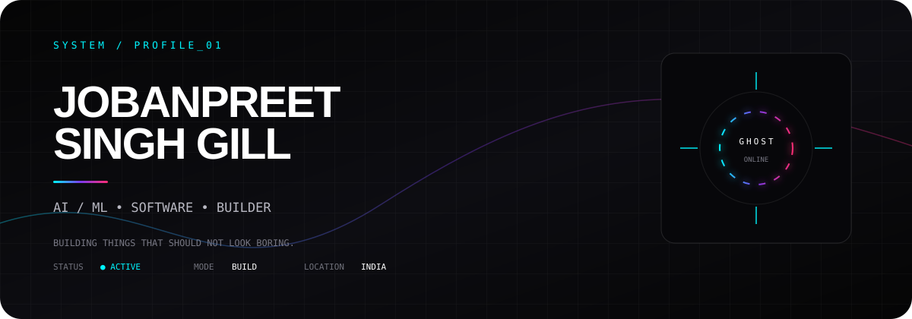
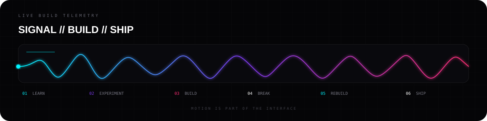
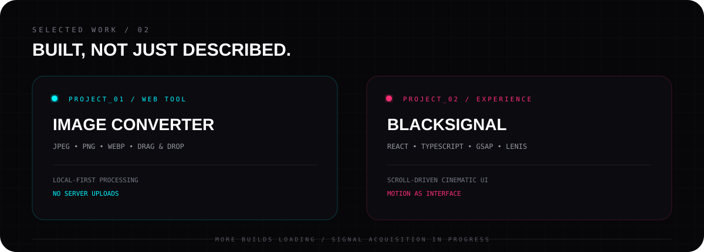
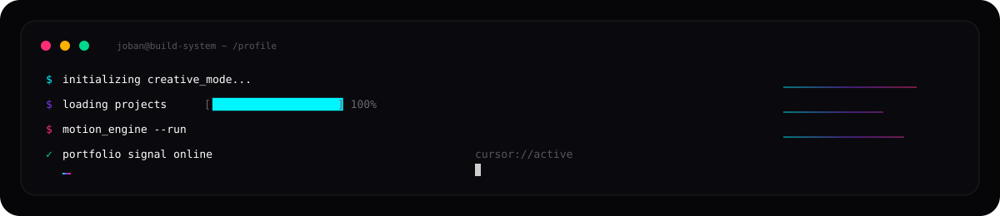
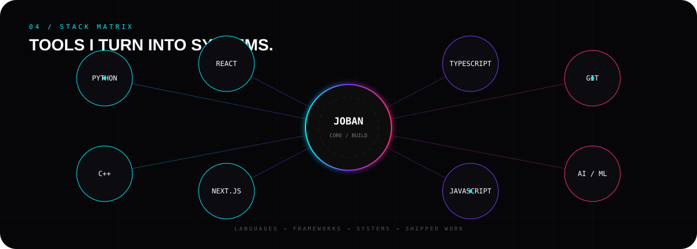
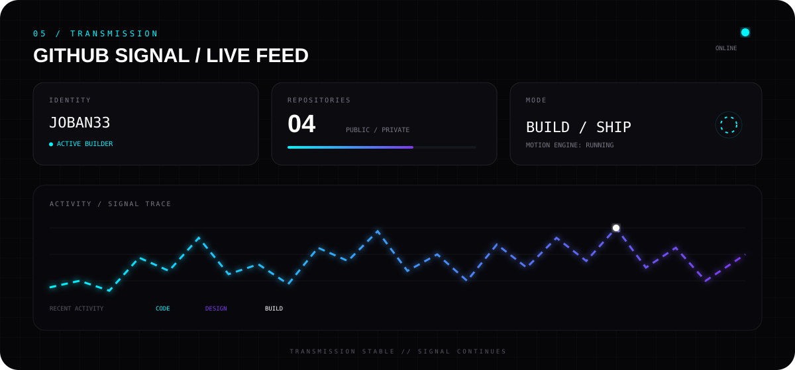

 

---

### `01 / NOW BUILDING`

`AI / ML`  `SOFTWARE`  `WEB`  `SYSTEMS`

**Learning → Experimenting → Building → Shipping**

---

### `02 / PROJECT SIGNAL`

 

**[ IMAGE CONVERTER → ](https://github.com/Joban33/Image-Converter)** &nbsp;&nbsp; **[ BLACKSIGNAL → ](https://github.com/Joban33/hacckker)**

---

### `03 / BUILD LOOP`

---

---

 

 

---

`[ BUILD ]`  `[ BREAK ]`  `[ REBUILD ]`  `[ SHIP ]`

**If it can be better, it isn't finished.**

