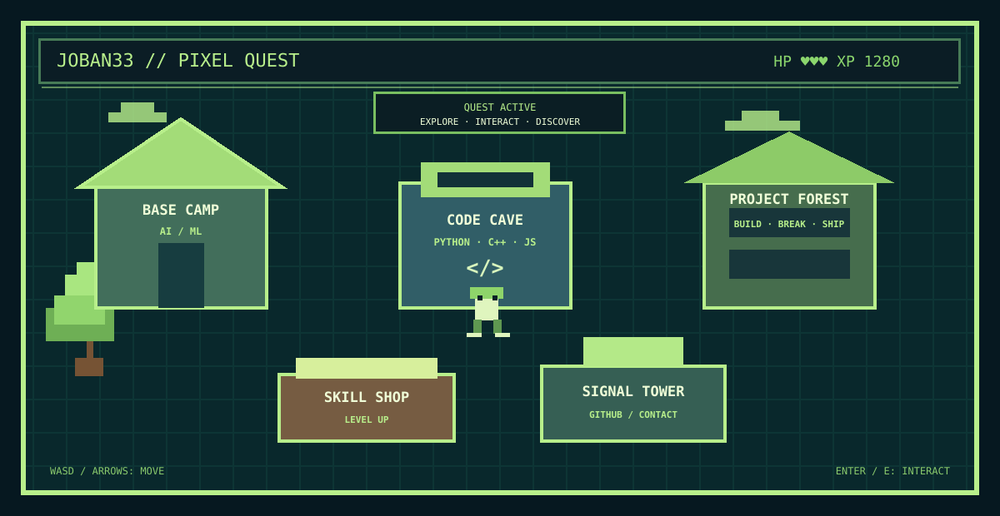

<div align="center">

# 🎮 JOBAN33 // PIXEL QUEST

**A 90s-inspired 8-bit portfolio instead of another dead GitHub README.**

[▶ PLAY THE PORTFOLIO](./pixel-world.html) · [GITHUB](https://github.com/Joban33)

</div>

---

<div align="center">

</div>

> **MISSION:** Explore the map. Find the locations. Interact with the world. Discover the builder behind the code.

### 🎮 CONTROLS

`W A S D` / `ARROW KEYS` → move  ·  `E` / `ENTER` → interact

**[▶ OPEN THE PLAYABLE WORLD](./pixel-world.html)**

> GitHub profile READMEs cannot execute arbitrary JavaScript, so the README contains the animated pixel-game scene while the actual playable version lives in `pixel-world.html`. The repository also includes `index.html` as a GitHub Pages entry point.

---

## 👾 PLAYER

**Jobanpreet Singh Gill**

B.Tech CSE (AI & ML) student building software, experimenting with AI/ML, and turning interfaces into experiences instead of templates.

```text
CLASS   : BUILDER
MODE    : AI / SOFTWARE / WEB / SYSTEMS
LOOP    : LEARN → EXPERIMENT → BUILD → BREAK → REBUILD → SHIP
STATUS  : ONLINE
```

---

## 🗺️ WORLD MAP

| Location | What you find |
| --- | --- |
| 🏠 **BASE CAMP** | Who I am and what I am building |
| 💻 **CODE CAVE** | Python, C++, JavaScript, React, Next.js and more |
| 🌲 **PROJECT FOREST** | Selected projects and experiments |
| ⚔️ **SKILL SHOP** | Current learning and skill progression |
| 📡 **SIGNAL TOWER** | GitHub and ways to connect |

---

## 🧰 INVENTORY

`Python` `C++` `JavaScript` `React` `Next.js` `TypeScript` `HTML` `CSS` `SQL` `Git` `GitHub`

---

## 🧪 CURRENT QUESTS

```text
PYTHON          █████████░  90%
C++             ███████░░░  70%
WEB DEVELOPMENT ████████░░  80%
AI / ML         █████░░░░░  50%
SYSTEMS & TOOLS ██████░░░░  60%
```

These are directional progress indicators, not fake claims of mastery.

---

## 🏆 BOSSES I'M BUILDING AGAINST

### Image Converter
A practical image conversion tool focused on a clean workflow.

**[ENTER PROJECT →](https://github.com/Joban33/Image-Converter)**

### BlackSignal
A cinematic web experience focused on motion, storytelling and interaction.

**[ENTER PROJECT →](https://github.com/Joban33/hacckker)**

---

## 💾 SAVE POINT

```text
╔══════════════════════════════════════╗
║  WORLD   : JOBAN33                  ║
║  STATUS  : SIGNAL ACTIVE            ║
║  NEXT    : BUILD →                  ║
║                                      ║
║         KEEP BUILDING.               ║
╚══════════════════════════════════════╝
```

<div align="center">

**[🎮 RE-ENTER THE WORLD](./pixel-world.html)**

</div>
