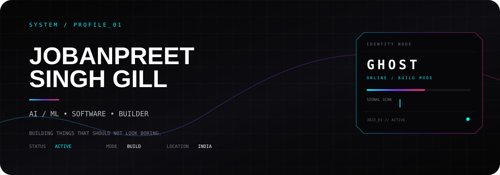
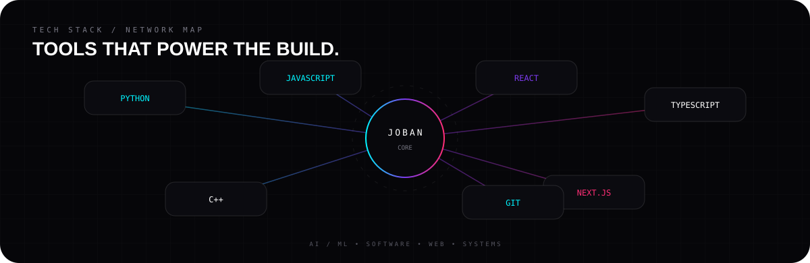
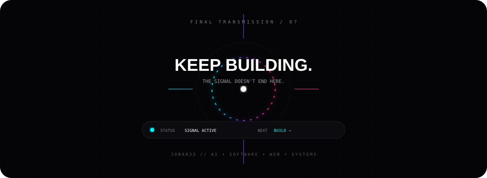

 

---

### `01 / NOW BUILDING`

`AI / ML`  `SOFTWARE`  `WEB`  `SYSTEMS`

**Learning → Experimenting → Building → Shipping**

---

### `02 / PROJECT SIGNAL`

 

**[ IMAGE CONVERTER → ](https://github.com/Joban33/Image-Converter)** &nbsp;&nbsp; **[ BLACKSIGNAL → ](https://github.com/Joban33/hacckker)**

---

### `03 / BUILD LOOP`

---

### `04 / STACK`

---

### `05 / TRANSMISSION`

 

**[ VIEW LIVE GITHUB ACTIVITY → ](https://github.com/Joban33)**

---

### `06 / FINAL TRANSMISSION`

 

**[ GITHUB ](https://github.com/Joban33) · [ PROJECTS ](https://github.com/Joban33?tab=repositories)**

